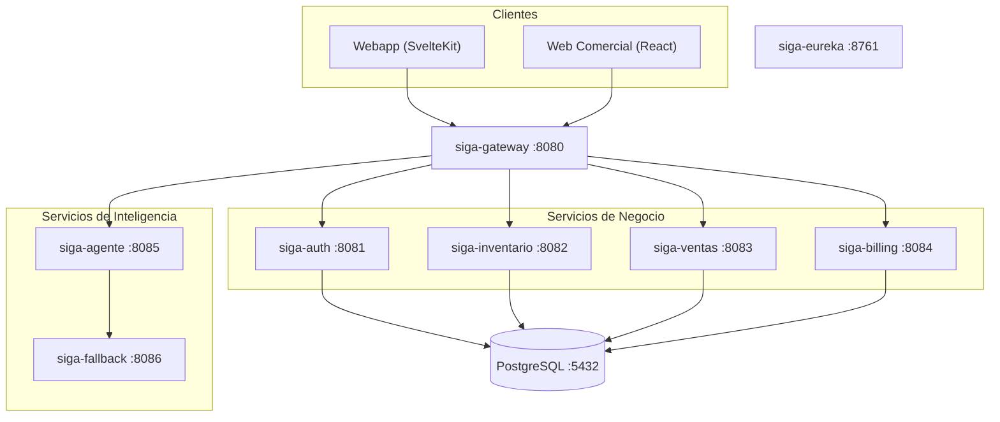
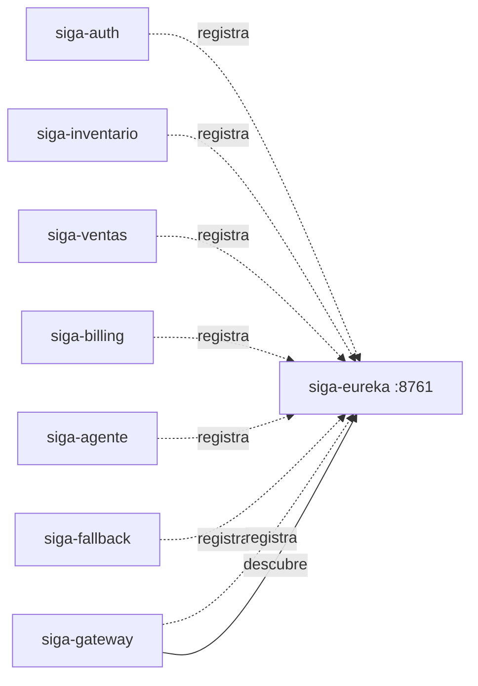
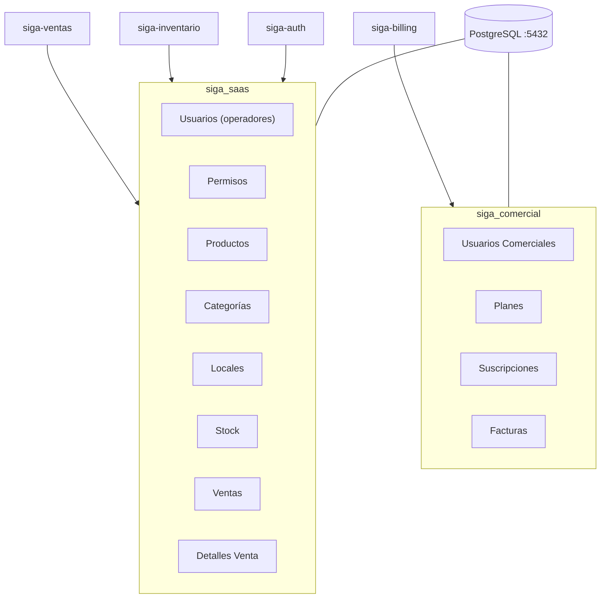
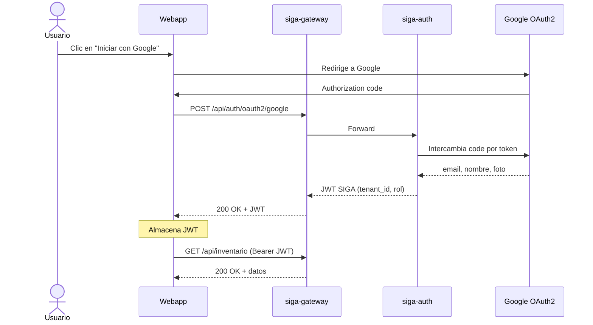
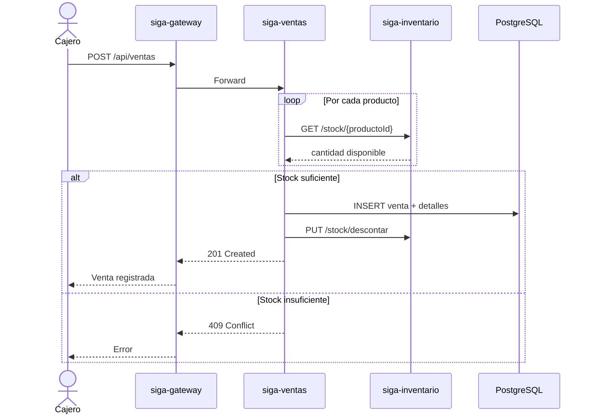
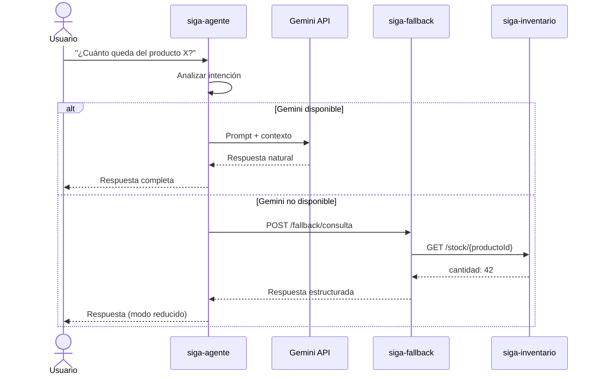
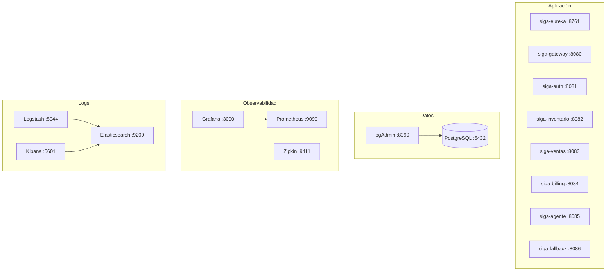
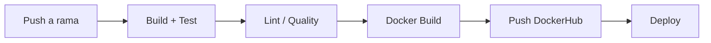
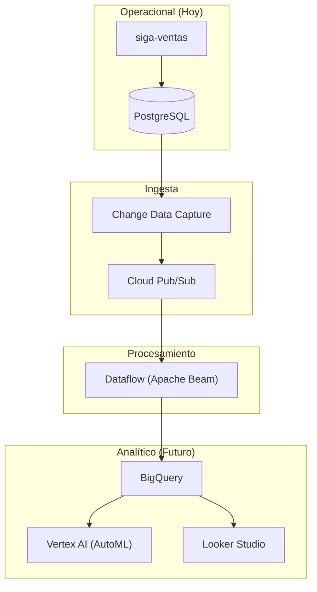

# Diagramas de Arquitectura — SIGA Microservicios

Diagramas técnicos del sistema SIGA en su arquitectura objetivo de microservicios.

---

## 1. Vista General del Sistema

> Nota: Todos los servicios se registran en `siga-eureka`. Las flechas de registro
> se omiten para mantener la claridad del diagrama.

---

## 2. Service Discovery (Eureka)

---

## 3. Esquema de Base de Datos

---

## 4. Flujo de Autenticación (OAuth2 + JWT)

---

## 5. Flujo de Venta

---

## 6. Flujo del Asistente IA con Fallback

---

## 7. Infraestructura Docker

> Nota: Todas las conexiones de los servicios de aplicación hacia la base de datos,
> Prometheus, Logstash y Zipkin se omiten para mantener la legibilidad.
> La red Docker (`siga-network`) conecta todos los contenedores entre sí.

---

## 8. Pipeline CI/CD

---

## 9. Preparación Big Data (GCP)

